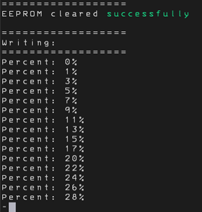
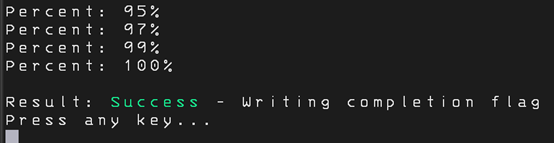
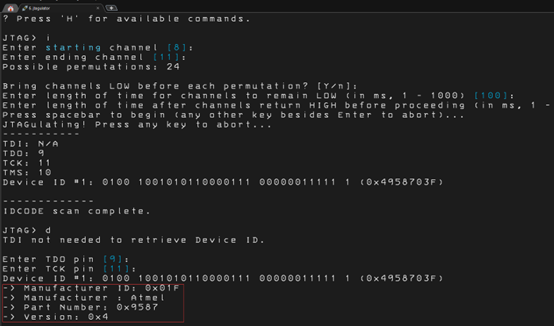
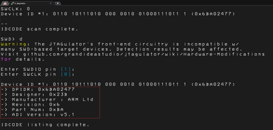

<div align="center">

🌍 **Language** / **语言选择**
  
[](readme.md)
[](readme.en.md)

</div>

---
# 🔍 JTAGulator-ID-Tracker

**基于JTAGulator的增强固件 | 集成超过2000家芯片厂商ID数据库**

*硬件安全测试工具 · JTAG/SWD接口扫描 · 芯片厂商自动识别*

---

## 📖 目录
- [项目简介](#项目简介)
- [✨ 新特性](#-新特性)
- [🧩 硬件要求](#-硬件要求)
- [📦 烧录指南](#-烧录指南)
- [🔧 使用展示](#-使用展示)
- [📊 厂商数据库](#-厂商数据库)
- [🎯 应用场景](#-应用场景)
- [🤝 贡献指南](#-贡献指南)
- [⚠️ 注意事项](#️-注意事项)
- [📄 许可证](#-许可证)

---

## 项目简介

**JTAGulator-ID-Tracker** 是基于原始 **[JTAGulator](https://github.com/grandideastudio/jtagulator)** 开源硬件的增强固件。JTAGulator 是由 Joe Grand（@joegrand）设计的硬件安全测试工具，专门用于识别嵌入式设备上的调试接口。

### 原版 JTAGulator 简介
- **功能**：自动发现 JTAG、SWD、UART 等调试接口
- **主控**：采用 Parallax Propeller P8X32A 微控制器
- **存储**：使用 24LC512 EEPROM（64KB）存储程序和数据
- **应用**：硬件安全研究、逆向工程、设备诊断

### 本项目的改进
原版固件仅使用了 EEPROM 的一半容量（32KB）。本项目充分利用了全部 64KB 空间，集成了庞大的芯片厂商识别数据库，在扫描接口的同时自动识别芯片制造商。

---

## ✨ 新特性

| 特性 | 原版 JTAGulator | 本增强版 |
| :--- | :--- | :--- |
| **EEPROM 使用率** | 50% (32KB/64KB) | 100% (64KB/64KB) |
| **厂商 ID 数据库** | 无 | **超过 2,000 家厂商** |
| **JTAG 扫描** | 仅发现接口 | **发现接口 + 显示厂商名称** |
| **SWD 扫描** | 仅发现接口 | **发现接口 + 显示厂商名称** |
| **数据库更新** | 无 | **一次烧录，永久使用** |

### 核心优势
1. **智能识别** - 自动识别 ARM、MIPS、PowerPC 等架构的芯片厂商
2. **效率提升** - 扫描过程中实时显示厂商信息，无需额外查询
3. **数据库完整** - 涵盖主流芯片厂商及众多小众制造商
4. **向后兼容** - 完全兼容原版 JTAGulator 所有功能

---

## 🧩 硬件要求

### 必需设备
- JTAGulator 硬件设备
- Mini USB 数据线（连接电脑）
- 杜邦线（用于连接目标设备）

### 目标设备支持
- 任何具有 JTAG 或 SWD 接口的嵌入式设备
- 不同电平的接口
- 任意波特率的串口
- 以及其他支持边界扫描的器件

---

## 📦 烧录指南

### 第一步：烧录厂商数据库
**这是最关键的一步，只需执行一次！**

```bash
# 使用 Propeller Tool 或 OpenPropeller 进行烧录
1. 打开 EEPROM_Update 文件夹
2. 将 `EEPROM_Update.spin` 设置为顶层文件
3. 连接 JTAGulator 到电脑
4. 编译并烧录到设备
```

**写入数据库过程说明：**
- 打开串口调试工具
- 设置波特率：115200 bps，8 数据位，1 停止位，无校验
- 连接 JTAGulator

<div align="center">

<p><em>写入数据库中</em></p>
</div>

- **等待写入完成，大约需要 20 分钟**
- 进度会在串口终端中显示
- 完成后设备会自动停止，未完成可以重新上电，写入成功后不会再次写入数据库

<div align="center">

<p><em>数据库写入完成</em></p>
</div>

> 💡 **重要提示**：数据库烧录过程较长，但这是值得的！完成后，您可以随意切换固件版本，都无需再次烧录数据库。

### 第二步：烧录主固件
```bash
1. 返回项目根目录
2. 将 `JTAGulator.spin` 设置为顶层文件
3. 编译并烧录到设备
4. 设备重启后即可使用
```

### 串口设置
| 参数 | 值 |
| :--- | :--- |
| 波特率 | 115200 |
| 数据位 | 8 |
| 停止位 | 1 |
| 校验 | 无 |
| 流控制 | 无 |

---

## 🔧 使用展示

<div align="center">

<p><em>JTAG扫描得到厂商名字</em></p>
</div>

<div align="center">

<p><em>SWD扫描得到厂商名字</em></p>
</div>

---

## 📊 厂商数据库

### 数据库统计
| 类别 | 数量 | 说明 |
| :--- | :--- | :--- |
| **主流芯片厂商** | 150+ | Intel, ARM, STM, NXP, TI 等 |
| **亚洲厂商** | 800+ | 中国大陆、台湾、韩国、日本厂商 |
| **专用芯片商** | 400+ | 通信、工控、汽车电子等领域 |
| **MCU 制造商** | 600+ | 各种微控制器厂商 |
| **其他厂商** | 50+ | FPGA、CPLD 等器件厂商 |

### 查询厂商信息
数据库包含以下关键信息：
- **厂商 ID** - 芯片 IDCODE 中的制造商代码
- **厂商名称** - 完整的公司名称
- **常用品牌** - 市场常见品牌名称
- **主要产品** - 代表性产品系列
- **官网链接** - 制造商官方网站

---

## 🎯 应用场景

### 1. 硬件安全评估
- 识别设备调试接口，评估安全风险
- 发现隐藏的测试点或调试接口
- 为渗透测试提供硬件接入点

### 2. 逆向工程研究
- 分析未知设备的芯片架构
- 识别芯片制造商和具体型号
- 获取调试接口信息进行深度分析

### 3. 设备修复与调试
- 修复变砖的嵌入式设备
- 访问设备的调试和编程接口
- 提取固件或进行固件更新

### 4. 教育学习
- 学习 JTAG/SWD 协议工作原理
- 理解边界扫描技术
- 掌握硬件调试接口识别方法

---

## 🤝 贡献指南

我们欢迎各种形式的贡献！

### 报告问题
发现 bug 请及时联系我

### 更新厂商数据库
发现缺失的厂商 ID？请提交：
- 芯片 IDCODE 值
- 制造商官方名称
- 数据来源链接（数据手册或官网）

---

## ⚠️ 注意事项

### 法律与道德提醒
- **仅用于授权的安全测试** - 请确保您有权测试目标设备
- **遵守法律法规** - 不同国家和地区对硬件调试有不同法律规定
- **尊重知识产权** - 不得用于盗版或侵权用途

### 技术注意事项
1. **电源要求** - 确保目标设备供电稳定，避免损坏
2. **引脚连接** - 仔细确认引脚对应关系，防止短路
3. **静电防护** - 操作敏感设备时注意静电防护
4. **首次烧录** - 数据库烧录只需一次，之后可随意更换固件

### 常见问题
**Q: 烧录数据库为什么需要20分钟？**  
A: EEPROM 写入速度较慢，且需要验证每个扇区，确保数据完整性。

**Q: 可以添加更多厂商吗？**  
A: 可以！目前应该可以再加一两百家厂商。

**Q: 支持哪些操作系统？**  
A: 推荐 **Propeller 1.3.2**烧录，串口工具随意。

**Q: 如何确认数据库烧录成功？**  
A: 烧录完成后，串口会显示 "Result: Success - Writing completion flag"。

---

## 📄 许可证

[](https://opensource.org/licenses/MIT)

### 致谢
- 感谢 Joe Grand 创建了优秀的 JTAGulator 硬件
- 感谢所有芯片厂商提供公开的技术文档
- 感谢社区成员的测试和反馈

---

<div align="center">

### 🌟 如果这个项目对您有帮助，请给个 Star！
**您的支持是我们持续改进的动力**

*最后更新：2025年12月*

</div>

---
